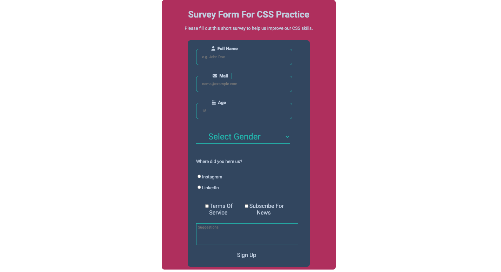

# Kayıt Formu

Bu proje basit bir HTML kayıt formudur.

## Form ÖZellikleri

- Başlık ('h1') ve açıklama ('p') içerir.
- İsim, e-posta ve yaş girişi için input alanları bulunur.
- Cinsiyet seçimi için dropdown menü vardır.
- Sosyal medya seçimi için radio butonları eklenmiştir.
- Hizmet şartlarını kabul etmek ve haberlere abone olmak için checkbox seçenekleri vardır.
- Mesaj yazmak için bir textarea bulunur.
- Formu göndermek için submit butonu vardır. 

## Ekran Görüntüsü

## Kullanımı

Formu tarayıcıda açarak test edebilirsiniz.

